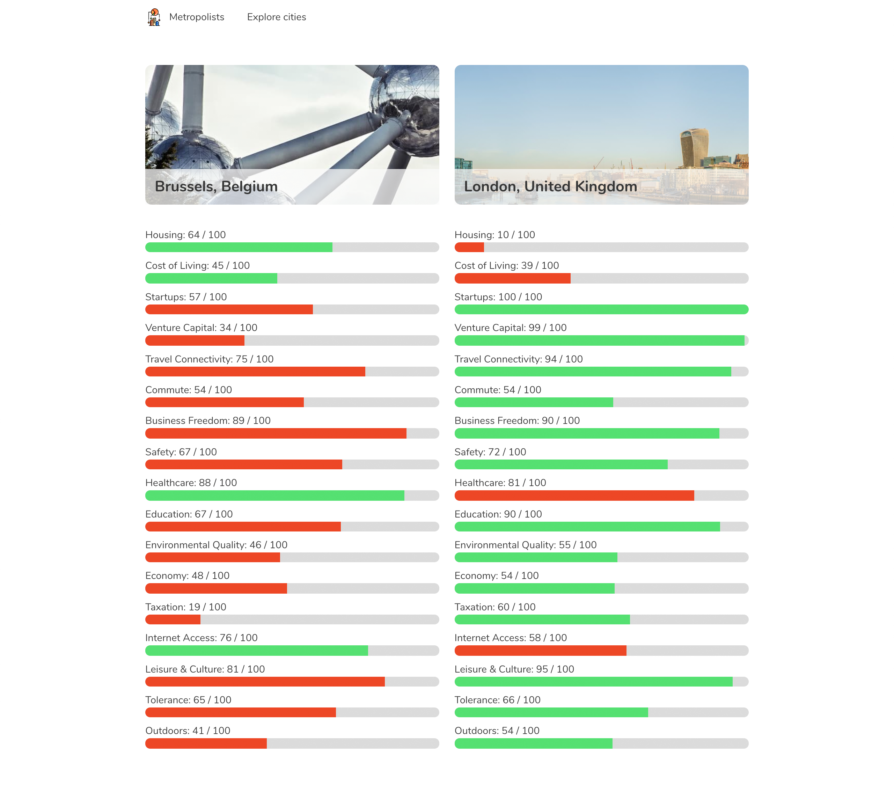

###  General Assembly, Software Engineering Immersive
# Metropolists

## Overview

This is my second project of the software engineering immersive course at GA London. The assignment was a mini hackathon to **build a React application** that consumes a **public API**. The project was to be completed **in teams of 2** within **48 hours**.

Making use of the Teleport public API, we built a website that allows the user to view some information about a number of cities across the world, as well as compare the living standard indicators of any two cities side-by-side. 

You can launch the site on GitHub pages [here](https://katheich.github.io/metropolists/), or find the GitHub repo [here](https://github.com/katheich/metropolists).

## Brief
- **Consume a public API** – this could be anything but it must make sense for your project.
- **Have several components** - At least one classical and one functional.
- **The app should include a router** - with several "pages".
- **Be deployed online** and accessible to the public.

## Technologies used
- JavaScript (ES6)
- React.js
- HTML, JSX
- Teleport API
- React Map GL (for Mapbox GL)
- Git and GitHub
- Bulma, SCSS
- Google Fonts

## Approach

- We decided as a team to search for a open working API which had images and information we could map on. We chose the teleport public API and began wireframing the website, gave ourselves a timeframe to finish the logic aspect on the first day and styling by the final day. 
​
- The main features we decided on were the following:
  - An landing page 
  - A filter which allows uses to search cities by their names and continents. 
  - A navbar which routes to the pages. 
  - Search through cities by name/country and filter by continents   ​
  - A compare component that allows you to see which city does better at different standards of living indicators
  - A detailed city view

- The routing of our page would be as follows:
  1. The landing page at path `/`
  2. The city overview page at `/cities`
  3. 

### Cities overview 

- Luckily, one of the end points of the Teleport API provided a complete list of the cities in the data alongside their images, so in order to list them all, we only needed a single API query

- Filtering cities: filters are tracked in state variables (`this.state.filters`), possible to both filter by continent and search via city or country name (in the render method, only `this.filterCities()` is mapped.)

  ```js
    filterCities() {
    const re = new RegExp(this.state.filters.search, 'i')
    return this.state.data.filter(city => {
      return (city.continent === this.state.filters.continent || this.state.filters.continent === 'All') && (re.test(city._links['ua:countries'][0].name) || re.test(city.name))
    })
  }

  handleContinentSelect(e) {
    const filters = { ...this.state.filters }
    filters.continent = e.target.value
    this.setState({ filters })
  }

  handleSearch(e) {
    const filters = { ...this.state.filters }
    filters.search = e.target.value
    this.setState({ filters })
  }
  ```

- Selecting cities: current selection is tracked in a state variable as well (`this.state.selection`). The selection both the adds to the selection if the city was not previously included, and removes the city from the selection if it was already included. The specific variable added to the selection array is the so-called slug, which the API uses to identify unique cities in its requests.

  ```js
      handleSelect(e) {
      const slug = e.target.dataset.slug

      let selection = [...this.state.selection]

      if (this.state.selection.includes(slug)) {

        selection = this.state.selection.filter((elem) => {
          return !(elem === slug)
        })

        this.setState({ selection })

      } else {
        selection.push(slug)
        this.setState({ selection })
      }    
    }
  ```

### City details

- Since the slug is not nicely formatted, and the Teleport API's response to individual city requests also did not provide a nicely formatted city name, we had to pass down the city name to the city details component 
  ```js
    handleDetails(e) {
    const city = [e.target.dataset.slug, e.target.dataset.name]
    this.setState({
      modalInfo: city
    }, () => this.toggleModal())
  }

  render(
    ...
    {(this.state.modal) ? <CityModal toggleModal={() => this.toggleModal()} info={this.state.modalInfo} /> : <></>}

  )
  ```

- To display the map centered on the city, a separate query to the API was needed. This provided the bounding box values, from which the centre was simply derived.
  ```js
  Axios.get(`https://api.teleport.org/api/urban_areas/slug:${slug}/`)
  .then(resp => {
    const { east, north, south, west } = resp.data.bounding_box.latlon
    const lat = (north + south) / 2
    const lon = (east + west) / 2

    const viewport = { ... this.state.viewport }
    viewport.latitude = lat
    viewport.longitude = lon

    this.setState({ viewport, latitude: lat, longitude: lon })

  })
  .catch(err => this.setState({ errors: err.response.status }))
  ```

- We used the 'find' method to show the relevant data received from the API, e.g. 
  ```js
  Currency exchange rate to USD: {this.state.data.categories.find(({ id }) => id === 'ECONOMY').data[1].float_value.toFixed(2)}
  ```


### Comparing two cities

- The compare button only becomes active if exactly two cities are in `this.selection`. Also, it will only forward the user to a new page, if `(this.state.selection.length === 2)`. 

- Due to the structure of the API, three separate API requests were necessary for each city to get all the information we wanted to display:
  1. Details (to show a nicely formatted name and country)
  2. Living standard statistics
  3. Cover photo of the city

- The state therefore tracked each of these bits of info separately for each city: 

  ```js
  this.state = {
  data1: {
    scores: [],
    photos: {},
    details: {}
  },
  data2: {
    scores: [],
    photos: {},
    details: {}
  },
  errors: {}
  }
  ```

- Each progress bar compares to the corresponding value of the other city to determine which colour should be displayed

  ```js
  <progress 
  className={`progress ${(category.score_out_of_10 > this.state.data2.scores.categories[i].score_out_of_10) ? 'is-link' : (category.score_out_of_10 < this.state.data2.scores.categories[i].score_out_of_10) ? 'is-warning' : 'is-primary'}`} 
  value={category.score_out_of_10} 
  max="10" 
  >
  </progress>
  ```

## Screenshots




## Potential future features

- Selecting more than two cities at a time
- Selecting cities from a map
- Including more information on the city details page (because the API has a lot more information!)
- Showing more detailed breakdowns of how standard of living indicators are derived (which the API also provides via a separate query)

## Bugs 

- If the category of information we selected is not available for that particular city, the details page will not load correctly

- React Router isn't working perfectly on GitHub Pages, as it allows routing via the homepage, but going to the absolute path directly does not work.

## Lessons learned

- Depending on the structure of the API, it can be quite tedious to get all the information that you want. For example, we were lucky in having an end-point on the Teleport API that provided *all* photos alongside the city names. However, the nicely formatted city name was only available on that endpoint and the city details request, so in a few instances we had to pass that information down to other components if we wanted to avoid adding another API request.

- Since the information available for each city wasn't perfectly identical, one couldn't rely on the order of information to display correctly. Hence, we used the 'find' method instead. However, this still didn't account for when the information isn't available at all, which should be fixed at a future iteration (i.e. the information should only be rendered if it exists).

- Deploying React Router on GitHub pages was also quite difficult, as many adjustments were needed to move from the dev-server. For instance, all images also had to be saved in the correct locations and the router needed to be pre-fixed with the correct path.

## Artwork and credit

[Teleport Public API](https://developers.teleport.org/api/) by Teleport.

[React Map GL](https://uber.github.io/react-map-gl/#/) by Uber.

Logo icon made by [Freepik](https://www.freepik.com/) from [www.flaticon.com](https://www.flaticon.com/).

Homepage background image created by me.

... and name provided by Michael Adair.